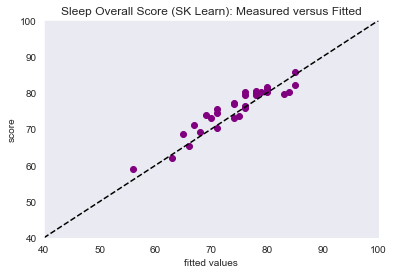

# Sleep Analysis

Analyzed my personal sleep data from my Fitbit Charge 5 in combination with the lunar phases.

## Data Sources

**Moon Phases**

Date: 03.04.2022
Source: `https://www.timeanddate.de/mond/phasen/` (Location: Basel):
- `raw/moon/*`

**Sleep Data**

Date: 18.06.2022
Source: export of complete fitbit data of privat account
files: 
- `raw/sleep/*` 
- `raw/heart/*` 
- `raw/temp/*`

## Data Wrangling
- Cleaning and transformation of data
- Merge data sets on attribute 'date'

 Master DataFrame after preprocessing:

| date     | skin_temp_avg | overall_score | composition_score | revitalization_score | duration_score | deep_sleep_in_minutes | resting_heart_rate | restlessness | avg_bpm   | Moon Phase    |
|----------|---------------|---------------|-------------------|----------------------|----------------|-----------------------|--------------------|--------------|-----------|---------------|
| 04.03.22 | 30.505155     | 67            | 17                | 15                   | 35             | 66                    | 60                 | 0.073479     | 66.494309 | New Moon      |
| 19.04.22 | 30.625221     | 75            | 16                | 17                   | 42             | 62                    | 52                 | 0.071966     | 58.762171 |               |
| 10.03.22 | 29.899359     | 88            | 21                | 22                   | 45             | 126                   | 60                 | 0.054695     | 60.620142 | First Quarter |
| 25.04.22 | 29.917705     | 56            | 15                | 15                   | 26             | 23                    | 56                 | 0.100186     | 60.969515 | Third Quarter |
| 08.06.22 | 30.016326     | 75            | 20                | 19                   | 36             | 69                    | 55                 | 0.087816     | 59.398694 | First Quarter |
| 01.01.22 | 30.85856      | 68            | 19                | 18                   | 31             | 69                    | 60                 | 0.081197     | 58.885041 | New Moon      |
| 15.01.22 | 32.980144     | 61            | 17                | 10                   | 34             | 70                    | 57                 | 0.14459      | 66.889982 |               |
| 14.01.22 | 31.024239     | 77            | 21                | 20                   | 36             | 82                    | 59                 | 0.089701     | 64.67045  |               |
| 09.06.22 | 30.251775     | 76            | 22                | 16                   | 38             | 88                    | 54                 | 0.07064      | 53.8481   | First Quarter |
| 24.04.22 | 30.351842     | 68            | 16                | 15                   | 37             | 49                    | 54                 | 0.079038     | 68.521044 | Third Quarter |

## Data Analysis

I looked at the distributions etc.
Furthermore, the moon phases do not seem to have a significant influence on my sleep:

## Linear Regression

-> some specific preprocessing for the algorithms (one hot encoding, shortening of column names, etc ...)

### Sklearn

**Sklearn Validation Set Measured vs Fitted**

MSE: 5.1

**Sklearn Test Set Measured vs Fitted**

Test Set MSE: 6.9

###  Statsmodels

MSE: 4.9

